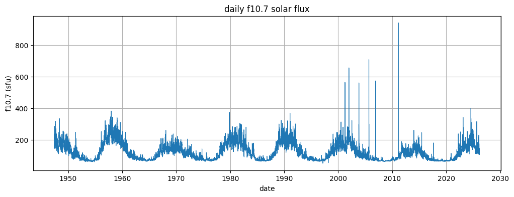
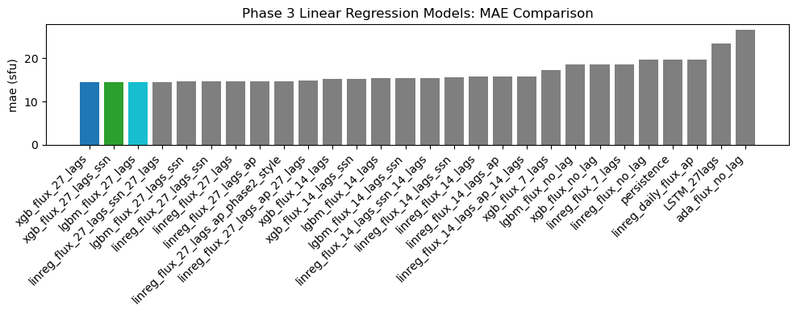
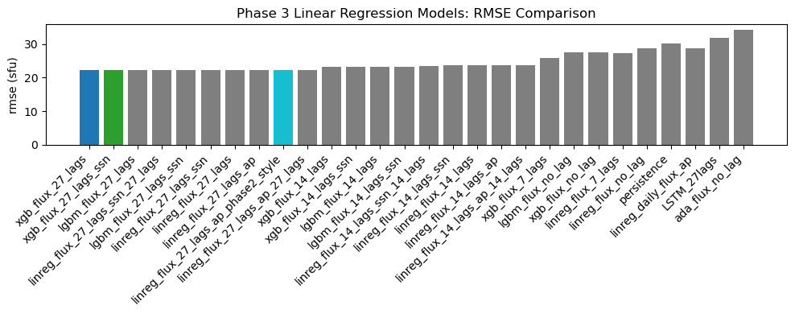
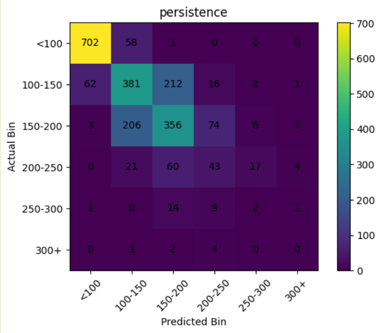
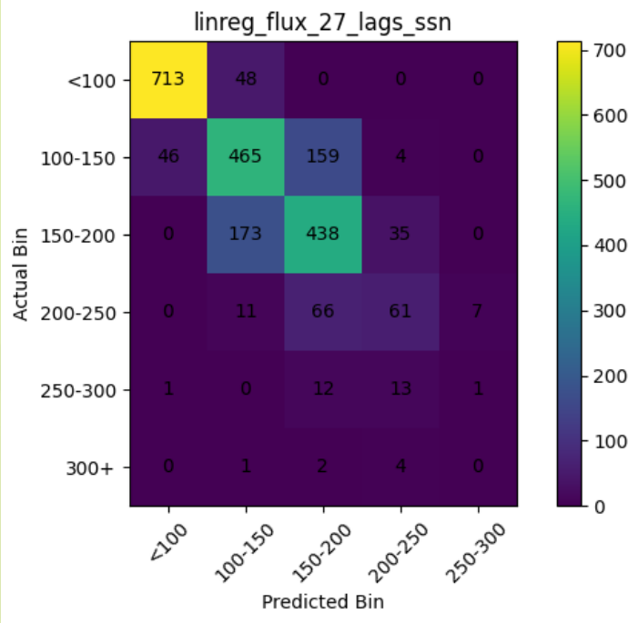
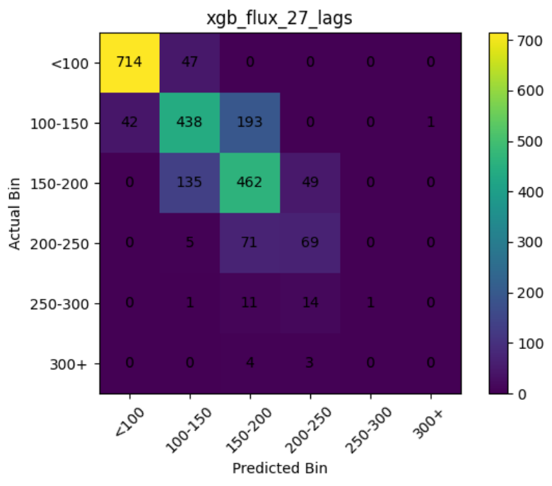
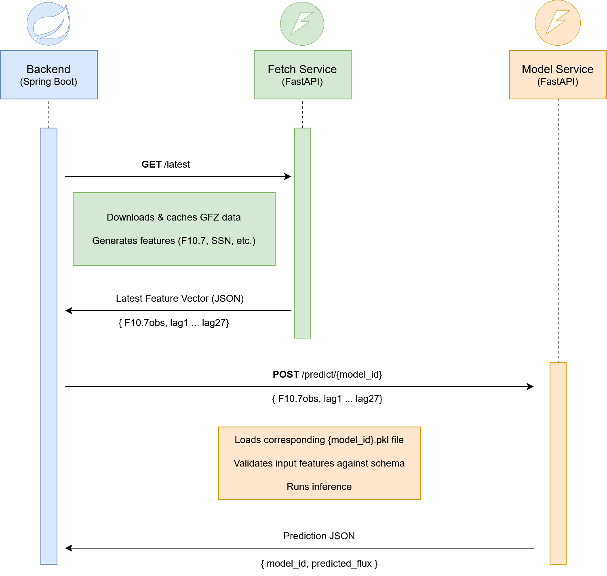

# CSULA Aerospace Senior Design: F10.7 Solar Flux Forecasting

## Table of Contents

- [Project Overview](#1-project-overview)
- [Machine Learning Research Overview](#2-machine-learning-research-overview)
  - [F10.7 Time Series Overview](#f107-time-series-overview)
- [Research Phases](#3-research-phases)
  - [Phase 1: Baseline Models](#31-phase-1--baseline-models)
  - [Phase 2: Feature Engineering & Data Exploration](#32-phase-2--feature-engineering--data-exploration)
  - [Phase 3: Evaluation Refinement & Final Models](#33-phase-3--evaluation-refinement--final-models)
- [Evaluation Methodology](#4-evaluation-methodology)
- [Feature Engineering](#5-feature-engineering)
  - [Core Features](#51-core-features)
  - [Additional Features](#52-additional-features)
- [Models Explored](#6-models-explored)
  - [Baseline Models](#61-baseline-models)
  - [Statistical Models](#62-statistical-models)
  - [Ensemble / Tree-Based Models](#63-ensemble--tree-based-models)
  - [Neural Networks](#64-neural-networks)
- [Final Model Selection](#7-final-model-selection)
- [Key Findings / Takeaways](#8-key-findings--takeaways)
- [System Integration](#9-system-integration)
- [How to Run](#10-how-to-run)
- [Team](#11-team)
- [Acknowledgments](#12-acknowledgments)

## 1. Project Overview

This project is part of the **CSULA Aerospace Senior Design Team (Fall 2025 - Spring 2026)**. Our goal is to forecast the **F10.7 solar radio flux index**, a key measure of solar activity used in space weather modeling, atmospheric drag calculations, and satellite operations.

The F10.7 index measures the intensity of solar **radio waves** at a wavelength of 10.7 cm. Radio waves are part of the electromagnetic spectrum, the same family as visible light, but at longer wavelengths that are not perceptible to the human eye.

The index is recorded daily in solar flux units (_sfu_) and serves as a reliable proxy for overall solar activity. Accurate forecasting supports prediction of satellite drag, GPS accuracy, and communication reliability during periods of elevated solar activity.

## 2. Machine Learning Research Overview

### F10.7 Time Series Overview



This plot shows the long-term behavior of the F10.7 signal across multiple solar cycles, highlighting periodic trends and occasional extreme spikes during high solar activity.

This project approaches F10.7 forecasting as a **time series prediction problem**, where historical observations are used to predict a future value. The primary task is to predict the daily F10.7 value at a fixed horizon of **t + 7 days**.

The problem is challenging due to several factors: strong short term autocorrelation, periodic behavior driven by the ~27 day solar rotation, long term variation across solar cycles, and occasional sharp spikes during active periods. These properties make simple models competitive in some regimes while limiting their ability to generalize across different phases of solar activity.

Machine learning research was conducted across **three phases**, progressing from baseline model evaluation, to feature engineering and data exploration, and finally to strict evaluation refinement and production ready model selection. Each phase introduced changes that significantly impacted performance conclusions and guided the final system design.

## 3. Research Phases

### 3.1 Phase 1: Baseline Models

The initial phase of research focused on establishing baseline performance and understanding the fundamental behavior of the dataset. The primary goal was to determine whether machine learning models could meaningfully outperform simple forecasting strategies.

The key benchmark used throughout this phase was the **persistence model**, which assumes that the future value is equal to the current value (i.e., F10.7 at t + 7 = F10.7 at t). Despite its simplicity, this model performed strongly, particularly during periods of low solar activity.

Additional models explored in this phase included early implementations of linear regression and random forest models using lagged F10.7 values as input features. These models introduced the concept of using historical context, but generally failed to consistently outperform the persistence baseline.

This phase established a critical foundation for the rest of the project: simple models are highly competitive for short-term F10.7 forecasting, and any meaningful improvement requires careful feature design and evaluation.

It is also important to note that this phase involved a significant learning curve for the team. As this was many members’ first exposure to applied machine learning, much of the work involved understanding core concepts such as model evaluation, time series structure, and proper validation techniques. This exploratory process played a key role in shaping later phases, where earlier assumptions were revisited and refined under more rigorous methodologies.

### 3.2 Phase 2 : Feature Engineering & Data Exploration

The second phase of research focused on expanding the input space and understanding which features meaningfully contribute to predictive performance. This phase introduced a wide range of experiments centered around lag depth, additional solar indicators, and cycle-aware evaluation.

A primary area of exploration was **lag feature design**. Experiments were conducted using varying lag windows (e.g., 7, 14, 27, and 54 days), with results showing that a **27-day lag window**, corresponding to one full solar rotation, provided the strongest and most consistent signal. Shorter lag windows lacked sufficient context, while longer windows introduced diminishing returns and additional noise.

Beyond raw F10.7 history, additional features were introduced, including **sunspot number (SSN)** and the **Ap geomagnetic index**. SSN provided small but consistent improvements in some configurations, particularly in stabilizing model behavior across solar cycles. In contrast, the Ap index showed limited predictive value under controlled evaluation and in some cases degraded performance.

This phase also introduced **cycle-based evaluation**, where model performance was analyzed across different solar cycles rather than relying on aggregate metrics. This revealed that some models performed well during stable cycles but failed to generalize to new or more volatile periods, particularly Solar Cycle 25.

Overall, this phase highlighted that feature engineering alone was not sufficient to guarantee improvement over baseline methods. While certain features and lag configurations provided incremental gains, results were highly sensitive to evaluation strategy and data segmentation, motivating the need for stricter validation in the next phase.

In addition, this phase marked the first transition from experimentation to system integration. The team **exported and serialized a LightGBM model (27 lag features with Ap-based features such as max and min)** and deployed it within the ML microservices architecture. This represented the first end-to-end integration of a trained model into the backend pipeline.

### 3.3 Phase 3 : Evaluation Refinement & Final Models

The third phase of research focused on correcting limitations in earlier evaluation methods and establishing a **deployment-aligned, production-ready modeling pipeline**. Rather than introducing entirely new model families, this phase emphasized ensuring that all results accurately reflected real-world forecasting conditions.

A major focus of this phase was the implementation of **strict walk-forward validation**, where models are trained only on past data and evaluated on future observations. This replaced earlier evaluation approaches and ensured that all models, including the persistence baseline, were tested under identical and realistic conditions.

During this process, several issues in earlier experimentation were identified and resolved. In particular, improper handling of preprocessing steps such as scaling introduced **data leakage**, where information from future observations unintentionally influenced training. After correcting these issues and enforcing proper time series validation, model performance decreased compared to earlier results, revealing that previous evaluations had been overly optimistic.

This phase also introduced a **forward-only evaluation on Solar Cycle 25**, which served as a true holdout period. Models that performed well in earlier phases did not always generalize to this new evaluation structure, reinforcing the importance of evaluating against unseen and more sporadic data.

Under this stricter evaluation framework, model behavior became more consistent and interpretable. Linear models demonstrated stronger-than-expected performance when properly evaluated, while **gradient boosting models (LightGBM and XGBoost)** emerged as the most effective approaches for capturing nonlinear patterns in the data. Among these, **XGBoost with a 27-day lag feature set** provided the strongest overall performance.

In addition to evaluation improvements, this phase finalized the transition from experimental notebooks to a **production-ready pipeline**. Models were retrained on the full available dataset after evaluation, serialized for deployment, and aligned with a consistent feature schema to ensure reliable inference within the broader system.

Overall, this phase established that evaluation methodology has a significant impact on model conclusions. By enforcing strict time series validation and eliminating hidden sources of error, the final results provide a more accurate and trustworthy representation of model performance in real-world forecasting scenarios.

This phase also significantly expanded the amount of models available. The previously deployed Phase 2 model was replaced by a broader set of **eight newly trained and evaluated models**, enabling more robust comparison, improved performance, and greater flexibility within the production system.

## 4. Evaluation Methodology

Accurate evaluation is critical in time series forecasting, as improper validation can lead to misleading results. Throughout this project, evaluation methodology evolved significantly to ensure that model performance reflects real-world forecasting conditions.

The final approach uses **walk-forward validation**, where models are trained on all available data up to time t and evaluated on future observations. This process is repeated sequentially, simulating how a model would operate in production. Unlike random train-test splits, this method preserves chronological order and prevents future data from influencing training.

A strict **no-leakage policy** is enforced across all experiments. All preprocessing steps, including scaling and feature construction, are applied using only training data within each evaluation window. This ensures that no information from future observations is introduced into the model during training.

To further ensure realistic evaluation, a **forward-only holdout on Solar Cycle 25** is used as the primary test regime. This provides a challenging and unseen dataset, allowing assessment of how well models generalize to new periods of solar activity rather than memorizing patterns from earlier cycles.

All models, including baseline methods such as persistence, are evaluated under identical conditions. Performance is measured using standard regression metrics, including **Mean Absolute Error (MAE)** and **Root Mean Squared Error (RMSE)**, allowing direct comparison across model types.

This evaluation framework ensures that reported results are consistent, reproducible, and aligned with real deployment scenarios. It also highlights that evaluation design has a substantial impact on model conclusions, reinforcing the importance of rigorous validation in time series machine learning.

## 5. Feature Engineering

Feature engineering played a central role in this project, as model performance depended heavily on how historical patterns and domain-specific information were represented. Across all phases, features were designed to capture recent behavior, recurring patterns, and potential relationships with external solar indicators.

### 5.1 Core Features

The foundation of all models in this project is the use of **lagged F10.7 values**. These features provide direct access to recent historical behavior and capture the strong autocorrelation present in the data.

The primary configuration consists of **27 lag features (lag1 through lag27)**, representing the previous 27 days of observed flux values. This window was chosen based on experimentation and aligns with the approximate **27-day solar rotation period**, allowing models to capture recurring patterns tied to solar surface activity.

These lag features proved to be the most important component of the feature set and were consistently used across nearly all models in later phases.

### 5.2 Additional Features

In addition to core lag features, several domain-informed variables were introduced to explore potential improvements in predictive performance. Below is a consolidated list of all non-core features evaluated, along with brief descriptions and observed impact.

**Features explored:**

- **Sunspot Number (SSN)**
  - _Description:_ Daily measure of visible solar activity, strongly correlated with long-term F10.7 trends.
  - _Usage:_ Included as raw daily values and lagged versions aligned with flux lags.
  - _Observation:_ Provided small but consistent improvements, particularly for stability across solar cycles.

- **Ap Geomagnetic Index**
  - _Description:_ Measures geomagnetic disturbances influenced by solar activity.
  - _Usage:_ Daily Ap, short lags (e.g., 1–3 days), and window statistics (**ap_max**, **ap_min**, **ap_mean**).
  - _Observation:_ Occasional improvements in isolated cases, but no consistent gains under strict evaluation.

- **Rolling Statistics (F10.7)**
  - _Description:_ Smoothed representations of recent flux values.
  - _Usage:_ 7-day and 27-day rolling averages.
  - _Observation:_ Helped reduce noise but did not outperform the 27-lag representation alone.

- **EUV / Mg II Index (Experimental)**
  - _Description:_ Proxy for solar EUV emissions.
  - _Usage:_ Preliminary integration attempts.
  - _Observation:_ Limited by data availability and alignment; not used in final pipeline.

- **Solar Cycle Indicators (Conceptual)**
  - _Description:_ Indicators of position within the ~11-year solar cycle.
  - _Usage:_ Considered for phase-aware modeling.
  - _Observation:_ Not fully implemented; cycle-aware evaluation proved more impactful than explicit features.

**Summary:** Additional features provided incremental gains at best. The majority of predictive signal was captured by the 27-day lagged F10.7 features, with other variables offering limited or inconsistent improvements.

#### Model Performance Comparison (Phase 3)





These charts compare model performance across multiple configurations during Phase 3. They reinforce the impact of lag selection and feature choices, as well as the importance of consistent evaluation.

## 6. Models Explored

This section summarizes the primary model families evaluated, along with how they were used and the key observations under consistent, walk-forward evaluation.

### 6.1 Baseline Models

- **Persistence**
  - _Description:_ Forecast equals the current value (t + h = t).
  - _Features:_ Current F10.7 value.
  - _Evaluation:_ Walk-forward, Cycle 25 holdout.
  - _Observation:_ Strong benchmark that is difficult to beat, especially during low activity.

### 6.2 Statistical Models

- **Linear Regression (Lag-based)**
  - _Description:_ Linear mapping from lagged inputs to future value.
  - _Features:_ F10.7 lags (primarily 27-day window), optional SSN.
  - _Evaluation:_ Walk-forward, no leakage.
  - _Observation:_ Surprisingly competitive when properly evaluated; benefits from strong autocorrelation in the signal.

- **SARIMA**
  - _Description:_ Seasonal autoregressive integrated moving average with a ~27-day seasonal component.
  - _Features:_ Implicit use of past values and seasonality; optional SSN.
  - _Evaluation:_ Cycle-aware tests.
  - _Observation:_ Captures periodic behavior but tends to over-smooth and underperform on short-term variation.

### 6.3 Ensemble / Tree-Based Models

- **Random Forest**
  - _Description:_ Ensemble of decision trees using bagging.
  - _Features:_ F10.7 lags, optional SSN.
  - _Evaluation:_ Walk-forward.
  - _Observation:_ Stable predictions but struggles with sharp spikes and does not consistently beat persistence.

- **LightGBM**
  - _Description:_ Gradient boosting with leaf-wise tree growth.
  - _Features:_ F10.7 lags (27-day), variants with SSN and Ap features.
  - _Evaluation:_ Cycle-based and walk-forward; later standardized.
  - _Observation:_ Strong nonlinear modeling; first model deployed in the system during Phase 2; performance sensitive to evaluation rigor.

- **XGBoost**
  - _Description:_ Gradient boosting with regularization and robust tree construction.
  - _Features:_ F10.7 lags (27-day), optional SSN.
  - _Evaluation:_ Walk-forward, Cycle 25 holdout.
  - _Observation:_ Best overall performance under strict evaluation; selected as the top model.

### 6.4 Neural Networks

- **LSTM (Recurrent Neural Network)**
  - _Description:_ Sequence model designed to capture temporal dependencies.
  - _Features:_ Sequences of lagged F10.7 values; experiments with additional inputs.
  - _Evaluation:_ Initially train test splits with scaling; later corrected to no-leakage walk-forward.
  - _Observation:_ Strong short-term fit in earlier tests, but performance decreased after removing leakage; less reliable than boosting models for this task.

## 7. Final Model Selection

Following Phase 3 evaluation and system integration, a subset of models was selected for deployment based on performance, consistency, and compatibility with the production pipeline.

**Selected Models:**

- **XGBoost (27-lag features)**
  - _Reason:_ Best overall performance under strict walk-forward evaluation.
  - _Strength:_ Captures nonlinear patterns and handles variability across solar activity levels.

- **LightGBM (27-lag variants)**
  - _Reason:_ Strong performance and efficient training.
  - _Strength:_ Provides a robust alternative boosting approach and was previously integrated into the system.

- **Linear Regression (27-lag)**
  - _Reason:_ Competitive performance with minimal complexity.
  - _Strength:_ Serves as a reliable, interpretable baseline under strict evaluation.

- **Persistence (Baseline)**
  - _Reason:_ Essential benchmark for comparison.
  - _Strength:_ Performs well during stable periods and highlights the difficulty of improving short-term forecasts.

These models were retrained on the full available dataset after evaluation and serialized for deployment within the ML microservices architecture. Each model uses a consistent feature schema, enabling interchangeable use within the backend system.

Overall, model selection prioritized **real-world performance, stability across solar cycles, and seamless system integration** over raw experimental results.

## 8. Key Findings / Takeaways

- **Persistence is a strong baseline** and remains difficult to outperform, especially during low solar activity.
- **27-day lag features capture the dominant signal**, aligning with the Sun’s rotation and providing most of the predictive power.
- **Additional features (SSN, Ap, rolling stats) provide limited and inconsistent gains** relative to core lag features.
- **Evaluation methodology materially changes conclusions**; enforcing walk-forward validation and removing leakage reduced earlier over-optimism.
- **Gradient boosting models (XGBoost, LightGBM) perform best overall** under strict, deployment-aligned evaluation.
- **Performance is distribution-dependent (SFU bins):**
  - High accuracy for low activity (<100 SFU) with strong diagonal alignment.
  - Reduced accuracy in the 100–200 SFU range with increased spread.
  - **Bias toward mid-range values (regression to the mean)**; misclassifications tend to remain within neighboring bins.
  - **Underprediction at high activity (>200 SFU)** with sparse, dispersed predictions.

### Heatmap Analysis (SFU Distribution)

These heatmaps illustrate how model predictions compare to actual values across binned SFU ranges, highlighting performance differences across levels of solar activity.

| Persistence                     | Linear Regression          |
| ------------------------------- | -------------------------- |
|  |  |

| LightGBM                 | XGBoost                 |
| ------------------------ | ----------------------- |
|  |  |

These visualizations reinforce key observations:

- Strong performance in low activity ranges
- Increased spread in mid-range values
- Consistent bias toward the mean
- Underprediction during high solar activity

## 9. System Integration

The machine learning models developed in this project are integrated into a microservices-based backend architecture, enabling real-time prediction and feature generation.

### Backend Integration Flow



This diagram illustrates the interaction between core services:

- **Spring Boot Backend** orchestrates requests and manages system flow
- **Fetch Service (FastAPI)** retrieves external data, caches it, and generates feature vectors
- **Model Service (FastAPI)** loads serialized models, validates inputs, and performs inference
- **PostgreSQL Database** stores features, predictions, and ground truth data for evaluation

## 10. How to Run

### 1. Clone the Repository

```bash
git clone https://github.com/csula-aero-25-26/forecast-model.git
cd forecast-model
```

### 2. Create a Virtual Environment

```bash
python -m venv .venv
```

Activate environment:

- **Windows:**

```bash
.venv/Scripts/activate
```

- **Mac/Linux:**

```bash
source .venv/bin/activate
```

### 3. Install Dependencies

Refer to the `requirements.txt` file within the specific phase or directory you are working in (e.g., `baseline/`, `phase2/`, `phase3/`).

```bash
pip install -r requirements.txt
```

### 4. Run Notebooks / Experiments

```bash
jupyter notebook
```

_If Jupyter Notebook is not installed, run_:

```bash
pip install notebook
```

## 11. Team

This project was developed as part of the **CSULA Aerospace Senior Design Team (Fall 2025 - Spring 2026)**.

**Advisor:**

- Dr. Zilong Ye

**Team Members:**

- Joshua Hanscom
- Rizza Barnwell
- Daniel Gomez
- Daniel Herrera
- Weihao Liu
- Emily Lopez
- Troy Rana
- Fabricio Reyes
- Maro Rodriguez
- Andy Voong

## 12. Acknowledgments

- **Data Sources:**
  - NOAA SWPC (F10.7 Solar Flux)
  - GFZ (Geomagnetic Data)
  - SILSO (Sunspot Numbers)

- Special thanks to faculty and advisors for guidance throughout the research and development process.
